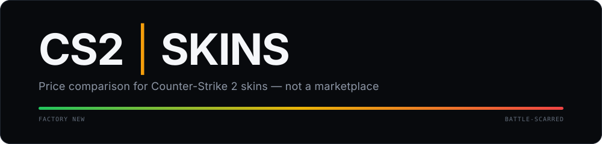

<div align="center">



<br><br>

**A PCPartPicker for CS2 skins.**
Compare what every marketplace is asking, then buy from whoever is cheapest right now.

<br>


<br>


</div>

<br>

> [!IMPORTANT]
> **This is not a marketplace.** Nothing is sold here and no money changes hands.
> The product aggregates public asking prices and links out to the marketplace
> with the best current offer.

The product definition lives in [`docs/CONCEPT.md`](docs/CONCEPT.md) (read-only).

---

## What it does

| Surface                  | What you get                                                         |
| :----------------------- | :------------------------------------------------------------------- |
| `/`                      | What the product is, a skin search, and the way into everything else |
| `/explore`               | The catalog, filtered by weapon, exterior, rarity and collection     |
| `/skins/[slug]`          | One skin: variants, marketplace comparison, 30-day price history     |
| `/kits` · `/kits/[slug]` | Curated sets, with live totals and the cheapest way to buy one       |
| `/build`                 | A loadout, slot by slot, priced on request and shareable as a link   |
| `/smart-loadout`         | A budget and a look in — a priced core loadout out                   |
| `/knife-gloves`          | Pair a knife with gloves, or the reverse, with pair totals           |
| `/wishlist`              | Skins saved in this browser, and how their prices have moved         |

Prices come from [CS2Cap](https://cs2cap.com), server-side only.

> [!NOTE]
> **No accounts and no database, by design.** Loadouts and wishlists live in the
> visitor's own browser; a loadout is shared by encoding it into a link. There is
> nothing to sign up for and nothing stored on a server.

---

## Status

The MVP is complete and runs in production.

<table>
<tr>
<td><b>Tests</b></td>
<td>1,518 unit · 268 end-to-end, against a real production build</td>
</tr>
<tr>
<td><b>Catalog</b></td>
<td>1,974 skins, grouped from ~21k upstream rows</td>
</tr>
<tr>
<td><b>Visual curation</b></td>
<td><b>161 of 1,974</b> skins classified by hand</td>
</tr>
<tr>
<td><b>Runtime</b></td>
<td>Long-lived Node process, ~215 MB steady state</td>
</tr>
</table>

Curation is deliberately partial, and that bounds recommendations and Smart
Loadout. An unclassified skin is still searchable and still priceable — colours
are never guessed from a skin's name, because `AWP | Atheris` sounds blue and is
green. See [`docs/VISUAL_METADATA.md`](docs/VISUAL_METADATA.md).

---

## Quick start

```sh
pnpm install
cp .env.example .env     # then add your CS2CAP_API_KEY
pnpm dev
```

Without a key the catalog and price layers fail with a configuration error;
everything static still renders.

<details>
<summary><b>All scripts</b></summary>

<br>

| Script           | Does                                                            |
| :--------------- | :-------------------------------------------------------------- |
| `pnpm dev`       | Dev server                                                      |
| `pnpm build`     | Production build (adapter-node → `build/`)                      |
| `pnpm start`     | **Run the production server** — `node build`                    |
| `pnpm preview`   | Vite's preview server (development convenience, not production) |
| `pnpm check`     | `svelte-check` + TypeScript                                     |
| `pnpm lint`      | `prettier --check` + ESLint                                     |
| `pnpm format`    | Format with Prettier                                            |
| `pnpm test`      | Unit + end-to-end                                               |
| `pnpm test:unit` | Vitest (unit + component)                                       |
| `pnpm test:e2e`  | Playwright, against a real production build                     |

End-to-end tests run against the adapter-node server with CS2Cap replaced by a
local stub (`e2e/mock-cs2cap.mjs`), so they never need a key and never depend on
a third party.

</details>

---

## Production

```sh
pnpm install --frozen-lockfile
pnpm build
CS2CAP_API_KEY=… ORIGIN=https://<your-domain> pnpm start
```

Or as a container:

```sh
docker build -t cs2-skins:latest .
docker run --rm -p 3000:3000 \
  -e CS2CAP_API_KEY="$CS2CAP_API_KEY" \
  -e ORIGIN="https://<your-domain>" \
  cs2-skins:latest
```

The image is **secret-independent** — no build arg, no baked `ENV`, no `.env` in
the build context. It runs as the non-root `node` user with `node build` as PID 1,
so `SIGTERM` reaches the server directly. `GET /api/health` is liveness and
touches nothing upstream, so a CS2Cap outage never restarts a healthy process.

**[`docs/DEPLOYMENT.md`](docs/DEPLOYMENT.md) is the full guide** — environment
contract, proxy assumptions, memory, security posture, and a launch checklist.

---

## Environment

[`.env.example`](.env.example) documents every variable. The ones that matter:

| Variable                      |                                                                              |
| :---------------------------- | :--------------------------------------------------------------------------- |
| `CS2CAP_API_KEY`              | **Required.** Server-only                                                    |
| `ORIGIN`                      | **Required in production.** Canonical tags and share links are built from it |
| `CS2CAP_BATCH_PRICES_ENABLED` | Whether this deployment may use batch price lookups. Match the CS2Cap plan   |

> [!WARNING]
> `CS2CAP_API_KEY` is server-only and must never be given a `PUBLIC_` prefix —
> that ships the value to every browser. It is read only under
> `$lib/server/**`, which SvelteKit refuses to bundle for the client, and an
> end-to-end test keeps the client bundle clean with a sentinel.

---

## Design system

Dark-only, amber-accented. Tokens live in `src/app.css` and are the single source
of truth — see [`docs/DESIGN_SYSTEM.md`](docs/DESIGN_SYSTEM.md).


`Inter` for text, `JetBrains Mono` for numbers. Money is always integer minor
units plus a currency, formatted `pt-BR` at render time — never divided in a
component.

---

## Documentation

Everything durable lives in [`/docs`](docs); this file and
[`CLAUDE.md`](CLAUDE.md) are the only documentation in the root.

| Area          |                                                                                                                                     |
| :------------ | :---------------------------------------------------------------------------------------------------------------------------------- |
| The product   | [`CONCEPT.md`](docs/CONCEPT.md) (read-only)                                                                                         |
| Architecture  | [`ARCHITECTURE.md`](docs/ARCHITECTURE.md) · [`PROVIDERS.md`](docs/PROVIDERS.md) · [`ROUTES.md`](docs/ROUTES.md)                     |
| Running it    | [`DEPLOYMENT.md`](docs/DEPLOYMENT.md)                                                                                               |
| The interface | [`DESIGN_SYSTEM.md`](docs/DESIGN_SYSTEM.md) · [`COMPONENTS.md`](docs/COMPONENTS.md) · [`FRONTEND_RULES.md`](docs/FRONTEND_RULES.md) |
| Curated data  | [`VISUAL_METADATA.md`](docs/VISUAL_METADATA.md) · [`KITS.md`](docs/KITS.md)                                                         |
| The features  | [`BUILDER.md`](docs/BUILDER.md) · [`SMART_LOADOUT.md`](docs/SMART_LOADOUT.md) · [`RECOMMENDATIONS.md`](docs/RECOMMENDATIONS.md)     |
|               | [`KNIFE_GLOVES.md`](docs/KNIFE_GLOVES.md) · [`WISHLIST.md`](docs/WISHLIST.md)                                                       |

> [!TIP]
> [`CLAUDE.md`](CLAUDE.md) holds the permanent working rules for this codebase.
> Read it before touching code — it is where the non-obvious constraints live.

---

## Not built

Consistent with the concept, and deliberately absent:

- accounts, cloud sync and community kits
- price alerts and notifications
- analytics of any kind
- no favicon or brand mark yet — the product name is a working label and the
  production domain is undecided, both business decisions rather than
  engineering ones
